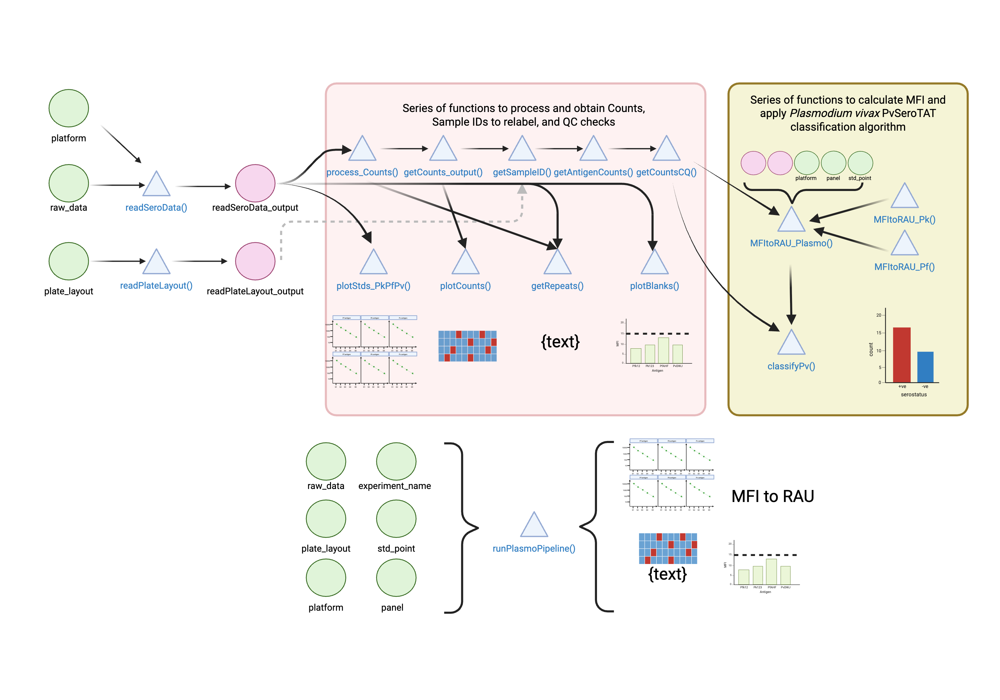
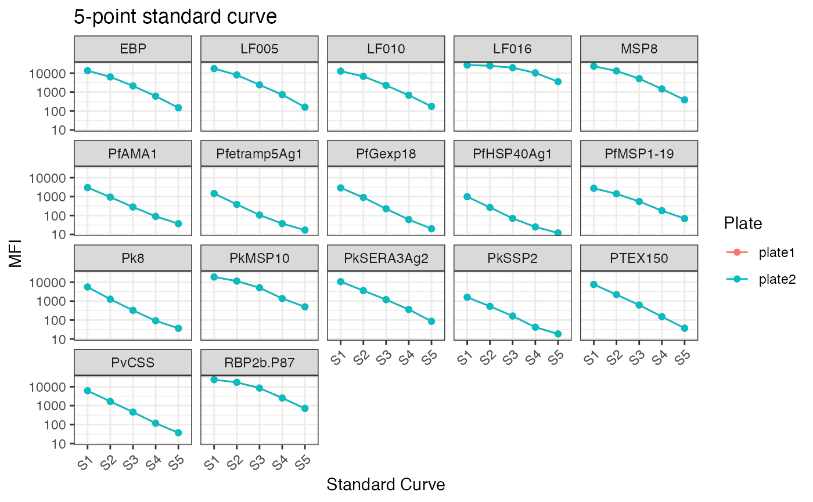
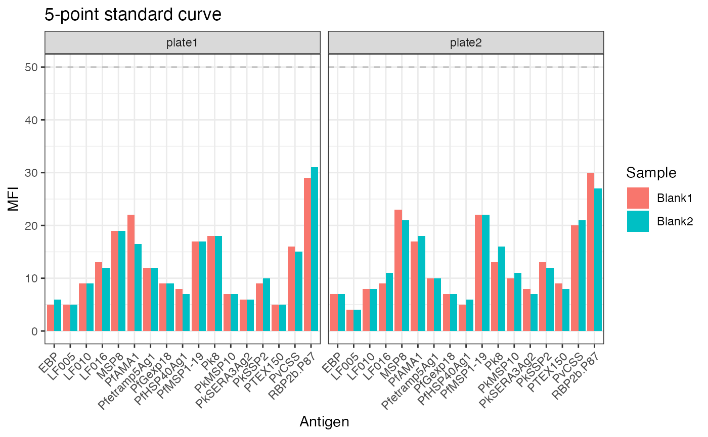
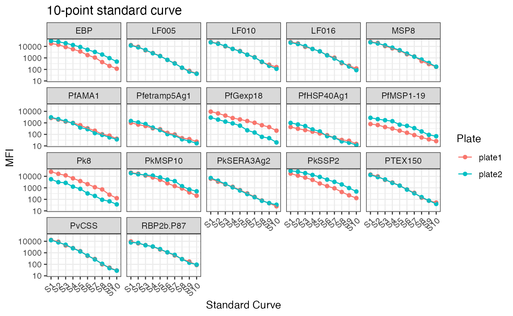
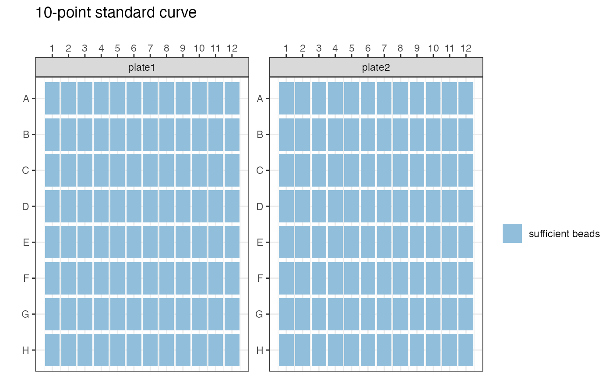
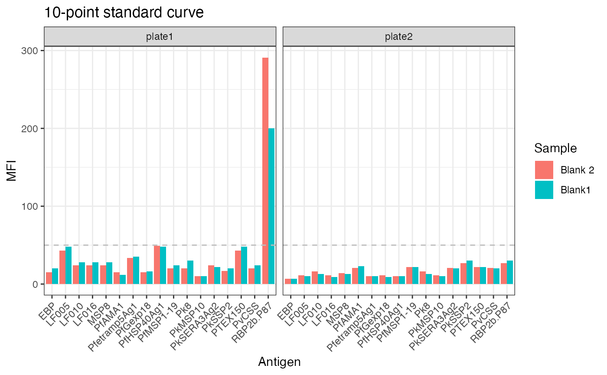

# Pk/Pv/Pf Serology Tutorial

For all of these analyses you can run as many plates as you wish.

### Visualisation of the Pk/Pv/Pf Pipeline



``` r
library(SeroTrackR)
library(tidyverse)
```

### 5-Point Standard Curve

#### Step 1: Load your data!

Firstly, we will be using our example data that’s in-built in the
package. Here replace the
[`system.file()`](https://rdrr.io/r/base/system.file.html) argument with
the file path for your package.

``` r
your_raw_data_5std <- c(
  system.file("extdata", "example_MAGPIX_pk_5std_plate1.csv", package = "SeroTrackR"),
  system.file("extdata", "example_MAGPIX_pk_5std_plate2.csv", package = "SeroTrackR")
)
your_plate_layout_5std <- system.file("extdata", "example_platelayout_pk_5std.xlsx", package = "SeroTrackR")
```

#### Step 2: Read your data and process MFI to RAU

This function to (a) process raw Serological data and (b) convert MFI to
RAU. The
[`runPlasmoPipeline()`](https://dionnecargy.github.io/SeroTrackR/reference/runPlasmoPipeline.md)
function will output three data frames:

1.  All_Results: All columns of every MFI to RAU conversion
2.  MFI_RAU: Just the SampleID, Plate, MFI and RAU values per antigen
3.  MFI_RAU_long: SampleID, Plate, MFI, RAU, Antigen, Species
    (long-format df)

``` r
results_5stdcurve <- runPlasmoPipeline(
  raw_data = your_raw_data_5std,
  platform = "magpix",
  plate_layout = your_plate_layout_5std,
  panel = "panel1",
  std_point = 5, 
  experiment_name = "5-point standard curve"
)
#> Registered S3 methods overwritten by 'meltr':
#>   method           from 
#>   print.date_names readr
#>   print.locale     readr
#> PASS: File example_magpix_pk_5std_plate1.csv successfully validated.
#> PASS: File example_magpix_pk_5std_plate2.csv successfully validated.
#> Plate layouts correctly identified!
#> QC Processes completed.
#> QC Plotting completed.
#> Joining with `by = join_by(SampleID, Location, Location.2, Sample, Plate,
#> QC_total, LF005_MFI, LF010_MFI, LF016_MFI, EBP_MFI, RBP2b.P87_MFI, PvCSS_MFI,
#> PTEX150_MFI, MSP8_MFI)`
#> MFI to RAU conversion completed.
#> Pv classification completed.
```

##### Standard Curve Plot

``` r
results_5stdcurve$std_curve
```



##### Bead Counts QC Plot

``` r
results_5stdcurve$bead_counts
```


##### Blanks QC Ploat

``` r
results_5stdcurve$blanks
```



##### MFI to RAU Tables

All results:

``` r
results_5stdcurve$mfi_outputs$All_Results %>%
  head() %>% 
  kable()
```

| SampleID | Location | Location.2 | Sample | Plate | Pk8_MFI | Pk8_log_mfi | Pk8_max_s1 | Pk8_max_dil | Pk8_slope | Pk8_low_asym | Pk8_upp_asym | Pk8_ed50 | Pk8_asym_par | Pk8_Dilution | PkMSP10_MFI | PkMSP10_log_mfi | PkMSP10_max_s1 | PkMSP10_max_dil | PkMSP10_slope | PkMSP10_low_asym | PkMSP10_upp_asym | PkMSP10_ed50 | PkMSP10_asym_par | PkMSP10_Dilution | PkSERA3Ag2_MFI | PkSERA3Ag2_log_mfi | PkSERA3Ag2_max_s1 | PkSERA3Ag2_max_dil | PkSERA3Ag2_slope | PkSERA3Ag2_low_asym | PkSERA3Ag2_upp_asym | PkSERA3Ag2_ed50 | PkSERA3Ag2_asym_par | PkSERA3Ag2_Dilution | PkSSP2_MFI | PkSSP2_log_mfi | PkSSP2_max_s1 | PkSSP2_max_dil | PkSSP2_slope | PkSSP2_low_asym | PkSSP2_upp_asym | PkSSP2_ed50 | PkSSP2_asym_par | PkSSP2_Dilution | QC_total | LF005_MFI | LF005_loglog_Dilution | LF005_DilutionReciprocal | LF005_MinStd | LF005_MaxDilution | LF005_MaxStd | LF005_MinDilution | LF010_MFI | LF010_loglog_Dilution | LF010_DilutionReciprocal | LF010_MinStd | LF010_MaxDilution | LF010_MaxStd | LF010_MinDilution | LF016_MFI | LF016_loglog_Dilution | LF016_DilutionReciprocal | LF016_MinStd | LF016_MaxDilution | LF016_MaxStd | LF016_MinDilution | EBP_MFI | EBP_loglog_Dilution | EBP_DilutionReciprocal | EBP_MinStd | EBP_MaxDilution | EBP_MaxStd | EBP_MinDilution | RBP2b.P87_MFI | RBP2b.P87_loglog_Dilution | RBP2b.P87_DilutionReciprocal | RBP2b.P87_MinStd | RBP2b.P87_MaxDilution | RBP2b.P87_MaxStd | RBP2b.P87_MinDilution | PvCSS_MFI | PvCSS_loglog_Dilution | PvCSS_DilutionReciprocal | PvCSS_MinStd | PvCSS_MaxDilution | PvCSS_MaxStd | PvCSS_MinDilution | PTEX150_MFI | PTEX150_loglog_Dilution | PTEX150_DilutionReciprocal | PTEX150_MinStd | PTEX150_MaxDilution | PTEX150_MaxStd | PTEX150_MinDilution | MSP8_MFI | MSP8_loglog_Dilution | MSP8_DilutionReciprocal | MSP8_MinStd | MSP8_MaxDilution | MSP8_MaxStd | MSP8_MinDilution | PfMSP1-19_MFI | PfMSP1-19_loglog_Dilution | PfMSP1-19_DilutionReciprocal | PfMSP1-19_MinStd | PfMSP1-19_MaxDilution | PfMSP1-19_MaxStd | PfMSP1-19_MinDilution | PfAMA1_MFI | PfAMA1_loglog_Dilution | PfAMA1_DilutionReciprocal | PfAMA1_MinStd | PfAMA1_MaxDilution | PfAMA1_MaxStd | PfAMA1_MinDilution | Pfetramp5Ag1_MFI | Pfetramp5Ag1_loglog_Dilution | Pfetramp5Ag1_DilutionReciprocal | Pfetramp5Ag1_MinStd | Pfetramp5Ag1_MaxDilution | Pfetramp5Ag1_MaxStd | Pfetramp5Ag1_MinDilution | PfHSP40Ag1_MFI | PfHSP40Ag1_loglog_Dilution | PfHSP40Ag1_DilutionReciprocal | PfHSP40Ag1_MinStd | PfHSP40Ag1_MaxDilution | PfHSP40Ag1_MaxStd | PfHSP40Ag1_MinDilution | PfGexp18_MFI | PfGexp18_loglog_Dilution | PfGexp18_DilutionReciprocal | PfGexp18_MinStd | PfGexp18_MaxDilution | PfGexp18_MaxStd | PfGexp18_MinDilution | EBP_ETHtoPNGloglog_Dilution | LF005_ETHtoPNGloglog_Dilution | LF010_ETHtoPNGloglog_Dilution | LF016_ETHtoPNGloglog_Dilution | MSP8_ETHtoPNGloglog_Dilution | PTEX150_ETHtoPNGloglog_Dilution | PvCSS_ETHtoPNGloglog_Dilution | RBP2b.P87_ETHtoPNGloglog_Dilution |
|:---|:---|:---|:---|:---|---:|---:|---:|---:|---:|---:|---:|---:|---:|---:|---:|---:|---:|---:|---:|---:|---:|---:|---:|---:|---:|---:|---:|---:|---:|---:|---:|---:|---:|---:|---:|---:|---:|---:|---:|---:|---:|---:|---:|---:|:---|---:|---:|---:|---:|---:|---:|---:|---:|---:|---:|---:|---:|---:|---:|---:|---:|---:|---:|---:|---:|---:|---:|---:|---:|---:|---:|---:|---:|---:|---:|---:|---:|---:|---:|---:|---:|---:|---:|---:|---:|---:|---:|---:|---:|---:|---:|---:|---:|---:|---:|---:|---:|---:|---:|---:|---:|---:|---:|---:|---:|---:|---:|---:|---:|---:|---:|---:|---:|---:|---:|---:|---:|---:|---:|---:|---:|---:|---:|---:|---:|---:|---:|---:|---:|---:|---:|---:|---:|---:|---:|---:|---:|---:|---:|---:|---:|---:|---:|---:|
| ABC-0001 | 13(1,B1) | B1 | Unknown13 | plate1 | 601 | 6.398595 | 8.631057 | 0.02 | -0.2551942 | 1.721839 | 14.738 | 0.0020263 | 1.430763 | 0.0017050 | 346.0 | 5.846439 | 9.847314 | 0.02 | -0.6004033 | 5.697488 | 10.13619 | 5.82e-05 | 2.423488 | 1.95e-05 | 858.0 | 6.754604 | 9.278139 | 0.02 | -0.1780712 | -7.81022 | 13.47082 | 4.95e-05 | 0.7487513 | 0.0005128 | 320.0 | 5.768321 | 7.38399 | 0.02 | -0.3905888 | 2.274053 | 9.060852 | 6.63e-05 | 2.808942 | 0.0019575 | pass | 389.0 | 0.0000834 | 11989.156 | 159 | 3.2e-05 | 17367 | 0.02 | 392 | 0.0000852 | 11732.800 | 174.5 | 3.2e-05 | 12754 | 0.02 | 502 | 1.95e-05 | 51200 | 3558.5 | 3.2e-05 | 26809.5 | 0.02 | 387.0 | 0.0000966 | 10352.512 | 149 | 3.2e-05 | 13445 | 0.02 | 831.5 | 0.0000400 | 25019.425 | 713 | 3.2e-05 | 23660.5 | 0.02 | 438.0 | 0.0007845 | 1274.6183 | 37 | 3.2e-05 | 6152 | 0.02 | 556.0 | 0.0007196 | 1389.6781 | 37 | 3.2e-05 | 7636 | 0.02 | 303.0 | 0.0000233 | 43006.509 | 387 | 3.2e-05 | 23226 | 0.02 | 363 | 0.0004380 | 2283.2281 | 69 | 3.2e-05 | 2751.5 | 0.02 | 359.5 | 0.0011172 | 895.0603 | 37 | 3.2e-05 | 3007 | 0.02 | 467 | 0.0050186 | 199.25926 | 17 | 3.2e-05 | 1459 | 0.02 | 384.0 | 0.0061629 | 162.26245 | 12 | 3.2e-05 | 988 | 0.02 | 1113 | 0.0052569 | 190.22706 | 20 | 3.2e-05 | 2892 | 0.02 | 0.0000258 | 0.0000923 | 0.0000800 | 0.0000762 | 0.0000064 | 0.0001358 | 0.0002014 | 1.07e-05 |
| ABC-0002 | 14(1,B2) | B2 | Unknown14 | plate1 | 344 | 5.840642 | 8.631057 | 0.02 | -0.2551942 | 1.721839 | 14.738 | 0.0020263 | 1.430763 | 0.0008863 | 228.5 | 5.431536 | 9.847314 | 0.02 | -0.6004033 | 5.697488 | 10.13619 | 5.82e-05 | 2.423488 | 1.95e-05 | 384.0 | 5.950643 | 9.278139 | 0.02 | -0.1780712 | -7.81022 | 13.47082 | 4.95e-05 | 0.7487513 | 0.0001857 | 112.5 | 4.722953 | 7.38399 | 0.02 | -0.3905888 | 2.274053 | 9.060852 | 6.63e-05 | 2.808942 | 0.0005508 | pass | 217.0 | 0.0000441 | 22679.984 | 159 | 3.2e-05 | 17367 | 0.02 | 242 | 0.0000475 | 21051.010 | 174.5 | 3.2e-05 | 12754 | 0.02 | 337 | 1.95e-05 | 51200 | 3558.5 | 3.2e-05 | 26809.5 | 0.02 | 226.0 | 0.0000518 | 19298.140 | 149 | 3.2e-05 | 13445 | 0.02 | 532.0 | 0.0000200 | 50124.782 | 713 | 3.2e-05 | 23660.5 | 0.02 | 171.0 | 0.0002491 | 4014.0622 | 37 | 3.2e-05 | 6152 | 0.02 | 377.0 | 0.0004553 | 2196.2460 | 37 | 3.2e-05 | 7636 | 0.02 | 483.0 | 0.0000423 | 23632.795 | 387 | 3.2e-05 | 23226 | 0.02 | 234 | 0.0002323 | 4304.3814 | 69 | 3.2e-05 | 2751.5 | 0.02 | 229.0 | 0.0006105 | 1638.0163 | 37 | 3.2e-05 | 3007 | 0.02 | 319 | 0.0031701 | 315.45144 | 17 | 3.2e-05 | 1459 | 0.02 | 256.0 | 0.0038047 | 262.83255 | 12 | 3.2e-05 | 988 | 0.02 | 634 | 0.0026246 | 381.01243 | 20 | 3.2e-05 | 2892 | 0.02 | 0.0000103 | 0.0000384 | 0.0000281 | 0.0000566 | 0.0000064 | 0.0000865 | 0.0000687 | 8.10e-06 |
| ABC-0003 | 15(1,B3) | B3 | Unknown15 | plate1 | 716 | 6.573680 | 8.631057 | 0.02 | -0.2551942 | 1.721839 | 14.738 | 0.0020263 | 1.430763 | 0.0020814 | 584.0 | 6.369901 | 9.847314 | 0.02 | -0.6004033 | 5.697488 | 10.13619 | 5.82e-05 | 2.423488 | 4.43e-05 | 4397.0 | 8.388678 | 9.278139 | 0.02 | -0.1780712 | -7.81022 | 13.47082 | 4.95e-05 | 0.7487513 | 0.0049920 | 271.0 | 5.602119 | 7.38399 | 0.02 | -0.3905888 | 2.274053 | 9.060852 | 6.63e-05 | 2.808942 | 0.0015955 | pass | 634.0 | 0.0001442 | 6936.337 | 159 | 3.2e-05 | 17367 | 0.02 | 663 | 0.0001605 | 6232.396 | 174.5 | 3.2e-05 | 12754 | 0.02 | 656 | 1.95e-05 | 51200 | 3558.5 | 3.2e-05 | 26809.5 | 0.02 | 673.5 | 0.0001845 | 5420.040 | 149 | 3.2e-05 | 13445 | 0.02 | 1390.5 | 0.0000777 | 12864.423 | 713 | 3.2e-05 | 23660.5 | 0.02 | 671.0 | 0.0013071 | 765.0369 | 37 | 3.2e-05 | 6152 | 0.02 | 731.5 | 0.0009980 | 1001.9749 | 37 | 3.2e-05 | 7636 | 0.02 | 519.0 | 0.0000463 | 21621.543 | 387 | 3.2e-05 | 23226 | 0.02 | 596 | 0.0009122 | 1096.3018 | 69 | 3.2e-05 | 2751.5 | 0.02 | 569.5 | 0.0020438 | 489.2749 | 37 | 3.2e-05 | 3007 | 0.02 | 913 | 0.0112317 | 89.03411 | 17 | 3.2e-05 | 1459 | 0.02 | 637.5 | 0.0114129 | 87.62002 | 12 | 3.2e-05 | 988 | 0.02 | 2061 | 0.0120404 | 83.05405 | 20 | 3.2e-05 | 2892 | 0.02 | 0.0000784 | 0.0001591 | 0.0001564 | 0.0000969 | 0.0000064 | 0.0001867 | 0.0003170 | 3.09e-05 |
| ABC-0004 | 16(1,B4) | B4 | Unknown16 | plate1 | 357 | 5.877736 | 8.631057 | 0.02 | -0.2551942 | 1.721839 | 14.738 | 0.0020263 | 1.430763 | 0.0009267 | 235.0 | 5.459586 | 9.847314 | 0.02 | -0.6004033 | 5.697488 | 10.13619 | 5.82e-05 | 2.423488 | 1.95e-05 | 437.5 | 6.081077 | 9.278139 | 0.02 | -0.1780712 | -7.81022 | 13.47082 | 4.95e-05 | 0.7487513 | 0.0002183 | 143.5 | 4.966335 | 7.38399 | 0.02 | -0.3905888 | 2.274053 | 9.060852 | 6.63e-05 | 2.808942 | 0.0007401 | pass | 238.0 | 0.0000487 | 20520.216 | 159 | 3.2e-05 | 17367 | 0.02 | 283 | 0.0000575 | 17395.576 | 174.5 | 3.2e-05 | 12754 | 0.02 | 318 | 1.95e-05 | 51200 | 3558.5 | 3.2e-05 | 26809.5 | 0.02 | 269.0 | 0.0000634 | 15768.910 | 149 | 3.2e-05 | 13445 | 0.02 | 582.0 | 0.0000233 | 42955.584 | 713 | 3.2e-05 | 23660.5 | 0.02 | 226.0 | 0.0003518 | 2842.7736 | 37 | 3.2e-05 | 6152 | 0.02 | 419.0 | 0.0005153 | 1940.4374 | 37 | 3.2e-05 | 7636 | 0.02 | 205.5 | 0.0000195 | 51200.000 | 387 | 3.2e-05 | 23226 | 0.02 | 266 | 0.0002796 | 3575.9145 | 69 | 3.2e-05 | 2751.5 | 0.02 | 265.0 | 0.0007440 | 1344.0629 | 37 | 3.2e-05 | 3007 | 0.02 | 322 | 0.0032063 | 311.89007 | 17 | 3.2e-05 | 1459 | 0.02 | 261.5 | 0.0039019 | 256.28686 | 12 | 3.2e-05 | 988 | 0.02 | 854 | 0.0037705 | 265.21947 | 20 | 3.2e-05 | 2892 | 0.02 | 0.0000114 | 0.0000484 | 0.0000408 | 0.0000542 | 0.0000064 | 0.0000978 | 0.0000959 | 8.50e-06 |
| ABC-0005 | 17(1,B5) | B5 | Unknown17 | plate1 | 1320 | 7.185387 | 8.631057 | 0.02 | -0.2551942 | 1.721839 | 14.738 | 0.0020263 | 1.430763 | 0.0041184 | 746.0 | 6.614726 | 9.847314 | 0.02 | -0.6004033 | 5.697488 | 10.13619 | 5.82e-05 | 2.423488 | 6.73e-05 | 1620.0 | 7.390181 | 9.278139 | 0.02 | -0.1780712 | -7.81022 | 13.47082 | 4.95e-05 | 0.7487513 | 0.0011927 | 778.0 | 6.656727 | 7.38399 | 0.02 | -0.3905888 | 2.274053 | 9.060852 | 6.63e-05 | 2.808942 | 0.0063403 | pass | 746.0 | 0.0001737 | 5757.719 | 159 | 3.2e-05 | 17367 | 0.02 | 892 | 0.0002301 | 4346.826 | 174.5 | 3.2e-05 | 12754 | 0.02 | 1352 | 1.95e-05 | 51200 | 3558.5 | 3.2e-05 | 26809.5 | 0.02 | 918.5 | 0.0002673 | 3740.619 | 149 | 3.2e-05 | 13445 | 0.02 | 1768.0 | 0.0001038 | 9632.812 | 713 | 3.2e-05 | 23660.5 | 0.02 | 666.5 | 0.0012967 | 771.2116 | 37 | 3.2e-05 | 6152 | 0.02 | 1220.5 | 0.0018568 | 538.5466 | 37 | 3.2e-05 | 7636 | 0.02 | 760.5 | 0.0000735 | 13605.973 | 387 | 3.2e-05 | 23226 | 0.02 | 846 | 0.0015869 | 630.1508 | 69 | 3.2e-05 | 2751.5 | 0.02 | 801.0 | 0.0031965 | 312.8449 | 37 | 3.2e-05 | 3007 | 0.02 | 1048 | 0.0132789 | 75.30767 | 17 | 3.2e-05 | 1459 | 0.02 | 852.0 | 0.0164593 | 60.75578 | 12 | 3.2e-05 | 988 | 0.02 | 2191 | 0.0131474 | 76.06085 | 20 | 3.2e-05 | 2892 | 0.02 | 0.0001145 | 0.0001912 | 0.0002249 | 0.0001941 | 0.0000417 | 0.0003388 | 0.0003148 | 5.54e-05 |
| ABC-0006 | 18(1,B6) | B6 | Unknown18 | plate1 | 899 | 6.801283 | 8.631057 | 0.02 | -0.2551942 | 1.721839 | 14.738 | 0.0020263 | 1.430763 | 0.0026892 | 733.0 | 6.597146 | 9.847314 | 0.02 | -0.6004033 | 5.697488 | 10.13619 | 5.82e-05 | 2.423488 | 6.54e-05 | 2702.5 | 7.901933 | 9.278139 | 0.02 | -0.1780712 | -7.81022 | 13.47082 | 4.95e-05 | 0.7487513 | 0.0024374 | 1015.0 | 6.922644 | 7.38399 | 0.02 | -0.3905888 | 2.274053 | 9.060852 | 6.63e-05 | 2.808942 | 0.0094388 | pass | 677.5 | 0.0001555 | 6430.684 | 159 | 3.2e-05 | 17367 | 0.02 | 895 | 0.0002310 | 4329.014 | 174.5 | 3.2e-05 | 12754 | 0.02 | 861 | 1.95e-05 | 51200 | 3558.5 | 3.2e-05 | 26809.5 | 0.02 | 888.0 | 0.0002566 | 3896.375 | 149 | 3.2e-05 | 13445 | 0.02 | 1728.0 | 0.0001010 | 9899.182 | 713 | 3.2e-05 | 23660.5 | 0.02 | 579.0 | 0.0010959 | 912.4657 | 37 | 3.2e-05 | 6152 | 0.02 | 967.5 | 0.0013984 | 715.1097 | 37 | 3.2e-05 | 7636 | 0.02 | 4955.0 | 0.0007581 | 1319.146 | 387 | 3.2e-05 | 23226 | 0.02 | 835 | 0.0015532 | 643.8484 | 69 | 3.2e-05 | 2751.5 | 0.02 | 788.5 | 0.0031310 | 319.3872 | 37 | 3.2e-05 | 3007 | 0.02 | 1040 | 0.0131555 | 76.01376 | 17 | 3.2e-05 | 1459 | 0.02 | 829.0 | 0.0158912 | 62.92790 | 12 | 3.2e-05 | 988 | 0.02 | 2080 | 0.0121993 | 81.97173 | 20 | 3.2e-05 | 2892 | 0.02 | 0.0001100 | 0.0001715 | 0.0002259 | 0.0001240 | 0.0006634 | 0.0002583 | 0.0002714 | 5.36e-05 |

MFI and RAU only:

``` r
results_5stdcurve$mfi_outputs$MFI_RAU %>%
  head() %>% 
  kable()
```

| SampleID | Plate | Pk8_MFI | PkMSP10_MFI | PkSERA3Ag2_MFI | PkSSP2_MFI | LF005_MFI | LF010_MFI | LF016_MFI | EBP_MFI | RBP2b.P87_MFI | PvCSS_MFI | PTEX150_MFI | MSP8_MFI | PfMSP1-19_MFI | PfAMA1_MFI | Pfetramp5Ag1_MFI | PfHSP40Ag1_MFI | PfGexp18_MFI | Pk8_Dilution | PkMSP10_Dilution | PkSERA3Ag2_Dilution | PkSSP2_Dilution | LF005_loglog_Dilution | LF010_loglog_Dilution | LF016_loglog_Dilution | EBP_loglog_Dilution | RBP2b.P87_loglog_Dilution | PvCSS_loglog_Dilution | PTEX150_loglog_Dilution | MSP8_loglog_Dilution | PfMSP1-19_loglog_Dilution | PfAMA1_loglog_Dilution | Pfetramp5Ag1_loglog_Dilution | PfHSP40Ag1_loglog_Dilution | PfGexp18_loglog_Dilution | EBP_ETHtoPNGloglog_Dilution | LF005_ETHtoPNGloglog_Dilution | LF010_ETHtoPNGloglog_Dilution | LF016_ETHtoPNGloglog_Dilution | MSP8_ETHtoPNGloglog_Dilution | PTEX150_ETHtoPNGloglog_Dilution | PvCSS_ETHtoPNGloglog_Dilution | RBP2b.P87_ETHtoPNGloglog_Dilution |
|:---|:---|---:|---:|---:|---:|---:|---:|---:|---:|---:|---:|---:|---:|---:|---:|---:|---:|---:|---:|---:|---:|---:|---:|---:|---:|---:|---:|---:|---:|---:|---:|---:|---:|---:|---:|---:|---:|---:|---:|---:|---:|---:|---:|
| ABC-0001 | plate1 | 601 | 346.0 | 858.0 | 320.0 | 389.0 | 392 | 502 | 387.0 | 831.5 | 438.0 | 556.0 | 303.0 | 363 | 359.5 | 467 | 384.0 | 1113 | 0.0017050 | 1.95e-05 | 0.0005128 | 0.0019575 | 0.0000834 | 0.0000852 | 1.95e-05 | 0.0000966 | 0.0000400 | 0.0007845 | 0.0007196 | 0.0000233 | 0.0004380 | 0.0011172 | 0.0050186 | 0.0061629 | 0.0052569 | 0.0000258 | 0.0000923 | 0.0000800 | 0.0000762 | 0.0000064 | 0.0001358 | 0.0002014 | 1.07e-05 |
| ABC-0002 | plate1 | 344 | 228.5 | 384.0 | 112.5 | 217.0 | 242 | 337 | 226.0 | 532.0 | 171.0 | 377.0 | 483.0 | 234 | 229.0 | 319 | 256.0 | 634 | 0.0008863 | 1.95e-05 | 0.0001857 | 0.0005508 | 0.0000441 | 0.0000475 | 1.95e-05 | 0.0000518 | 0.0000200 | 0.0002491 | 0.0004553 | 0.0000423 | 0.0002323 | 0.0006105 | 0.0031701 | 0.0038047 | 0.0026246 | 0.0000103 | 0.0000384 | 0.0000281 | 0.0000566 | 0.0000064 | 0.0000865 | 0.0000687 | 8.10e-06 |
| ABC-0003 | plate1 | 716 | 584.0 | 4397.0 | 271.0 | 634.0 | 663 | 656 | 673.5 | 1390.5 | 671.0 | 731.5 | 519.0 | 596 | 569.5 | 913 | 637.5 | 2061 | 0.0020814 | 4.43e-05 | 0.0049920 | 0.0015955 | 0.0001442 | 0.0001605 | 1.95e-05 | 0.0001845 | 0.0000777 | 0.0013071 | 0.0009980 | 0.0000463 | 0.0009122 | 0.0020438 | 0.0112317 | 0.0114129 | 0.0120404 | 0.0000784 | 0.0001591 | 0.0001564 | 0.0000969 | 0.0000064 | 0.0001867 | 0.0003170 | 3.09e-05 |
| ABC-0004 | plate1 | 357 | 235.0 | 437.5 | 143.5 | 238.0 | 283 | 318 | 269.0 | 582.0 | 226.0 | 419.0 | 205.5 | 266 | 265.0 | 322 | 261.5 | 854 | 0.0009267 | 1.95e-05 | 0.0002183 | 0.0007401 | 0.0000487 | 0.0000575 | 1.95e-05 | 0.0000634 | 0.0000233 | 0.0003518 | 0.0005153 | 0.0000195 | 0.0002796 | 0.0007440 | 0.0032063 | 0.0039019 | 0.0037705 | 0.0000114 | 0.0000484 | 0.0000408 | 0.0000542 | 0.0000064 | 0.0000978 | 0.0000959 | 8.50e-06 |
| ABC-0005 | plate1 | 1320 | 746.0 | 1620.0 | 778.0 | 746.0 | 892 | 1352 | 918.5 | 1768.0 | 666.5 | 1220.5 | 760.5 | 846 | 801.0 | 1048 | 852.0 | 2191 | 0.0041184 | 6.73e-05 | 0.0011927 | 0.0063403 | 0.0001737 | 0.0002301 | 1.95e-05 | 0.0002673 | 0.0001038 | 0.0012967 | 0.0018568 | 0.0000735 | 0.0015869 | 0.0031965 | 0.0132789 | 0.0164593 | 0.0131474 | 0.0001145 | 0.0001912 | 0.0002249 | 0.0001941 | 0.0000417 | 0.0003388 | 0.0003148 | 5.54e-05 |
| ABC-0006 | plate1 | 899 | 733.0 | 2702.5 | 1015.0 | 677.5 | 895 | 861 | 888.0 | 1728.0 | 579.0 | 967.5 | 4955.0 | 835 | 788.5 | 1040 | 829.0 | 2080 | 0.0026892 | 6.54e-05 | 0.0024374 | 0.0094388 | 0.0001555 | 0.0002310 | 1.95e-05 | 0.0002566 | 0.0001010 | 0.0010959 | 0.0013984 | 0.0007581 | 0.0015532 | 0.0031310 | 0.0131555 | 0.0158912 | 0.0121993 | 0.0001100 | 0.0001715 | 0.0002259 | 0.0001240 | 0.0006634 | 0.0002583 | 0.0002714 | 5.36e-05 |

MFI and RAU long table:

``` r
results_5stdcurve$mfi_outputs$MFI_RAU_long %>%
  head() %>% 
  kable()
```

| SampleID | Plate  | Antigens   | Species | MFI |       RAU | RAU_Method     |
|:---------|:-------|:-----------|:--------|----:|----------:|:---------------|
| ABC-0001 | plate1 | Pk8        | Pk      | 601 | 0.0017050 | loglog         |
| ABC-0001 | plate1 | PkMSP10    | Pk      | 346 | 0.0000195 | loglog         |
| ABC-0001 | plate1 | PkSERA3Ag2 | Pk      | 858 | 0.0005128 | loglog         |
| ABC-0001 | plate1 | PkSSP2     | Pk      | 320 | 0.0019575 | loglog         |
| ABC-0001 | plate1 | LF005      | Pv      | 389 | 0.0000834 | loglog         |
| ABC-0001 | plate1 | LF005      | Pv      | 389 | 0.0000923 | ETHtoPNGloglog |

### 10-Point Standard Curve

These steps are very similar to the 5-point standard curve, except where
indicated.

#### Step 1: Load your data!

``` r
your_raw_data_10std <- c(
  system.file("extdata", "example_MAGPIX_pk_10std_plate1.csv", package = "SeroTrackR"),
  system.file("extdata", "example_MAGPIX_pk_10std_plate2.csv", package = "SeroTrackR")
)
your_plate_layout_10std <- system.file("extdata", "example_platelayout_pk_10std.xlsx", package = "SeroTrackR")
```

#### Step 2: Read your data and process MFI to RAU

``` r
results_10stdcurve <- runPlasmoPipeline(
  raw_data = your_raw_data_10std,
  platform = "magpix",
  plate_layout = your_plate_layout_10std,
  panel = "panel1",
  std_point = 10, ################################### here make sure you write 10! 
  experiment_name = "10-point standard curve"
)
#> PASS: File example_magpix_pk_10std_plate1.csv successfully validated.
#> PASS: File example_magpix_pk_10std_plate2.csv successfully validated.
#> Plate layouts correctly identified!
#> QC Processes completed.
#> QC Plotting completed.
#> Joining with `by = join_by(SampleID, Location, Location.2, Sample, Plate,
#> QC_total, LF005_MFI, LF010_MFI, LF016_MFI, EBP_MFI, RBP2b.P87_MFI, PvCSS_MFI,
#> PTEX150_MFI, MSP8_MFI)`
#> MFI to RAU conversion completed.
#> Pv classification completed.
```

##### Standard Curve Plot

``` r
results_10stdcurve$std_curve
```



##### Bead Counts QC Plot

``` r
results_10stdcurve$bead_counts
```



##### Blanks QC Ploat

``` r
results_10stdcurve$blanks
```



##### MFI to RAU Tables

All results:

``` r
results_10stdcurve$mfi_outputs$All_Results %>%
  head() %>% 
  kable()
```

| SampleID | Location | Location.2 | Sample | Plate | Pk8_MFI | Pk8_log_mfi | Pk8_max_s1 | Pk8_max_dil | Pk8_slope | Pk8_low_asym | Pk8_upp_asym | Pk8_ed50 | Pk8_asym_par | Pk8_Dilution | PkMSP10_MFI | PkMSP10_log_mfi | PkMSP10_max_s1 | PkMSP10_max_dil | PkMSP10_slope | PkMSP10_low_asym | PkMSP10_upp_asym | PkMSP10_ed50 | PkMSP10_asym_par | PkMSP10_Dilution | PkSERA3Ag2_MFI | PkSERA3Ag2_log_mfi | PkSERA3Ag2_max_s1 | PkSERA3Ag2_max_dil | PkSERA3Ag2_slope | PkSERA3Ag2_low_asym | PkSERA3Ag2_upp_asym | PkSERA3Ag2_ed50 | PkSERA3Ag2_asym_par | PkSERA3Ag2_Dilution | PkSSP2_MFI | PkSSP2_log_mfi | PkSSP2_max_s1 | PkSSP2_max_dil | PkSSP2_slope | PkSSP2_low_asym | PkSSP2_upp_asym | PkSSP2_ed50 | PkSSP2_asym_par | PkSSP2_Dilution | QC_total | LF005_MFI | LF005_loglog_Dilution | LF005_DilutionReciprocal | LF005_MinStd | LF005_MaxDilution | LF005_MaxStd | LF005_MinDilution | LF010_MFI | LF010_loglog_Dilution | LF010_DilutionReciprocal | LF010_MinStd | LF010_MaxDilution | LF010_MaxStd | LF010_MinDilution | LF016_MFI | LF016_loglog_Dilution | LF016_DilutionReciprocal | LF016_MinStd | LF016_MaxDilution | LF016_MaxStd | LF016_MinDilution | EBP_MFI | EBP_loglog_Dilution | EBP_DilutionReciprocal | EBP_MinStd | EBP_MaxDilution | EBP_MaxStd | EBP_MinDilution | RBP2b.P87_MFI | RBP2b.P87_loglog_Dilution | RBP2b.P87_DilutionReciprocal | RBP2b.P87_MinStd | RBP2b.P87_MaxDilution | RBP2b.P87_MaxStd | RBP2b.P87_MinDilution | PvCSS_MFI | PvCSS_loglog_Dilution | PvCSS_DilutionReciprocal | PvCSS_MinStd | PvCSS_MaxDilution | PvCSS_MaxStd | PvCSS_MinDilution | PTEX150_MFI | PTEX150_loglog_Dilution | PTEX150_DilutionReciprocal | PTEX150_MinStd | PTEX150_MaxDilution | PTEX150_MaxStd | PTEX150_MinDilution | MSP8_MFI | MSP8_loglog_Dilution | MSP8_DilutionReciprocal | MSP8_MinStd | MSP8_MaxDilution | MSP8_MaxStd | MSP8_MinDilution | PfMSP1-19_MFI | PfMSP1-19_loglog_Dilution | PfMSP1-19_DilutionReciprocal | PfMSP1-19_MinStd | PfMSP1-19_MaxDilution | PfMSP1-19_MaxStd | PfMSP1-19_MinDilution | PfAMA1_MFI | PfAMA1_loglog_Dilution | PfAMA1_DilutionReciprocal | PfAMA1_MinStd | PfAMA1_MaxDilution | PfAMA1_MaxStd | PfAMA1_MinDilution | Pfetramp5Ag1_MFI | Pfetramp5Ag1_loglog_Dilution | Pfetramp5Ag1_DilutionReciprocal | Pfetramp5Ag1_MinStd | Pfetramp5Ag1_MaxDilution | Pfetramp5Ag1_MaxStd | Pfetramp5Ag1_MinDilution | PfHSP40Ag1_MFI | PfHSP40Ag1_loglog_Dilution | PfHSP40Ag1_DilutionReciprocal | PfHSP40Ag1_MinStd | PfHSP40Ag1_MaxDilution | PfHSP40Ag1_MaxStd | PfHSP40Ag1_MinDilution | PfGexp18_MFI | PfGexp18_loglog_Dilution | PfGexp18_DilutionReciprocal | PfGexp18_MinStd | PfGexp18_MaxDilution | PfGexp18_MaxStd | PfGexp18_MinDilution | EBP_ETHtoPNGloglog_Dilution | LF005_ETHtoPNGloglog_Dilution | LF010_ETHtoPNGloglog_Dilution | LF016_ETHtoPNGloglog_Dilution | MSP8_ETHtoPNGloglog_Dilution | PTEX150_ETHtoPNGloglog_Dilution | PvCSS_ETHtoPNGloglog_Dilution | RBP2b.P87_ETHtoPNGloglog_Dilution |
|:---|:---|:---|:---|:---|---:|---:|---:|---:|---:|---:|---:|---:|---:|---:|---:|---:|---:|---:|---:|---:|---:|---:|---:|---:|---:|---:|---:|---:|---:|---:|---:|---:|---:|---:|---:|---:|---:|---:|---:|---:|---:|---:|---:|---:|:---|---:|---:|---:|---:|---:|---:|---:|---:|---:|---:|---:|---:|---:|---:|---:|---:|---:|---:|---:|---:|---:|---:|---:|---:|---:|---:|---:|---:|---:|---:|---:|---:|---:|---:|---:|---:|---:|---:|---:|---:|---:|---:|---:|---:|---:|---:|---:|---:|---:|---:|---:|---:|---:|---:|---:|---:|---:|---:|---:|---:|---:|---:|---:|---:|---:|---:|---:|---:|---:|---:|---:|---:|---:|---:|---:|---:|---:|---:|---:|---:|---:|---:|---:|---:|---:|---:|---:|---:|---:|---:|---:|---:|---:|---:|---:|---:|---:|---:|---:|
| ABC-0001 | 25(1,C1) | C1 | Unknown25 | plate1 | 1953.0 | 7.577122 | 10.11523 | 0.02 | -3.51772 | -5.449795 | 8.563904 | 0.0006497 | 0.0231174 | 2.68e-04 | 1095.0 | 6.998510 | 9.938372 | 0.02 | -3.189257 | 2.674807 | 8.666433 | 0.0005417 | 0.0673256 | 0.0001188 | 5761.0 | 8.658866 | 8.724207 | 0.02 | -3.933695 | 0.0330283 | 6.955762 | 0.0007694 | 0.0511214 | 0.0000195 | 901.5 | 6.804060 | 9.752665 | 0.02 | -3.129037 | 0.1037915 | 8.270118 | 0.0007188 | 0.0456963 | 0.0001809 | pass | 1020 | 0.0009250 | 1081.1273 | 44 | 3.91e-05 | 13024 | 0.02 | 1987.0 | 0.0006429 | 1555.3802 | 161 | 3.91e-05 | 24023.5 | 0.02 | 5070 | 0.0019240 | 519.7601 | 121.5 | 3.91e-05 | 23687 | 0.02 | 3140 | 0.0011049 | 905.0766 | 116 | 3.91e-05 | 17664 | 0.02 | 15170.0 | 0.0200000 | 50.0000 | 86 | 3.91e-05 | 9648 | 0.02 | 672.0 | 0.0007174 | 1393.9789 | 29 | 3.91e-05 | 13146.5 | 0.02 | 1350 | 0.0011264 | 887.7506 | 52.5 | 3.91e-05 | 14354 | 0.02 | 1751.0 | 0.0004915 | 2034.5996 | 167 | 3.91e-05 | 24512 | 0.02 | 1221 | 0.0200000 | 50.0000 | 26 | 3.91e-05 | 792.5 | 0.02 | 873.5 | 0.0022286 | 448.7084 | 42 | 3.91e-05 | 2658 | 0.02 | 1058.0 | 0.0200000 | 50.0000 | 23.5 | 3.91e-05 | 1009 | 0.02 | 863.0 | 0.0200000 | 50.00000 | 15 | 3.91e-05 | 438 | 0.02 | 2303.0 | 0.0014819 | 674.7885 | 211 | 3.91e-05 | 9475 | 0.02 | 0.0005117 | 0.0010659 | 0.0005896 | 0.0165594 | 0.0004472 | 0.0002156 | 0.0001776 | 0.0181453 |
| ABC-0002 | 26(1,C2) | C2 | Unknown26 | plate1 | 492.5 | 6.199495 | 10.11523 | 0.02 | -3.51772 | -5.449795 | 8.563904 | 0.0006497 | 0.0231174 | 6.70e-05 | 296.5 | 5.692047 | 9.938372 | 0.02 | -3.189257 | 2.674807 | 8.666433 | 0.0005417 | 0.0673256 | 0.0000222 | 4583.0 | 8.430109 | 8.724207 | 0.02 | -3.933695 | 0.0330283 | 6.955762 | 0.0007694 | 0.0511214 | 0.0000195 | 214.5 | 5.368310 | 9.752665 | 0.02 | -3.129037 | 0.1037915 | 8.270118 | 0.0007188 | 0.0456963 | 0.0000334 | pass | 329 | 0.0003250 | 3077.2102 | 44 | 3.91e-05 | 13024 | 0.02 | 369.5 | 0.0001128 | 8864.7593 | 161 | 3.91e-05 | 24023.5 | 0.02 | 521 | 0.0001926 | 5193.1622 | 121.5 | 3.91e-05 | 23687 | 0.02 | 346 | 0.0001219 | 8200.6370 | 116 | 3.91e-05 | 17664 | 0.02 | 778.0 | 0.0004303 | 2324.0862 | 86 | 3.91e-05 | 9648 | 0.02 | 264.5 | 0.0003277 | 3051.9223 | 29 | 3.91e-05 | 13146.5 | 0.02 | 500 | 0.0004605 | 2171.3223 | 52.5 | 3.91e-05 | 14354 | 0.02 | 324.0 | 0.0000843 | 11861.3051 | 167 | 3.91e-05 | 24512 | 0.02 | 364 | 0.0032324 | 309.3700 | 26 | 3.91e-05 | 792.5 | 0.02 | 366.0 | 0.0006612 | 1512.4952 | 42 | 3.91e-05 | 2658 | 0.02 | 462.5 | 0.0037578 | 266.1167 | 23.5 | 3.91e-05 | 1009 | 0.02 | 368.5 | 0.0136944 | 73.02272 | 15 | 3.91e-05 | 438 | 0.02 | 1003.5 | 0.0003596 | 2780.5551 | 211 | 3.91e-05 | 9475 | 0.02 | 0.0000385 | 0.0003910 | 0.0000999 | 0.0019141 | 0.0000467 | 0.0000873 | 0.0000815 | 0.0002659 |
| ABC-0003 | 27(1,C3) | C3 | Unknown27 | plate1 | 136.5 | 4.916325 | 10.11523 | 0.02 | -3.51772 | -5.449795 | 8.563904 | 0.0006497 | 0.0231174 | 1.95e-05 | 36.0 | 3.583519 | 9.938372 | 0.02 | -3.189257 | 2.674807 | 8.666433 | 0.0005417 | 0.0673256 | 0.0000195 | 465.0 | 6.142037 | 8.724207 | 0.02 | -3.933695 | 0.0330283 | 6.955762 | 0.0007694 | 0.0511214 | 0.0004228 | 63.0 | 4.143135 | 9.752665 | 0.02 | -3.129037 | 0.1037915 | 8.270118 | 0.0007188 | 0.0456963 | 0.0000195 | pass | 64 | 0.0000636 | 15719.9263 | 44 | 3.91e-05 | 13024 | 0.02 | 50.0 | 0.0000195 | 51200.0000 | 161 | 3.91e-05 | 24023.5 | 0.02 | 113 | 0.0000376 | 26614.7105 | 121.5 | 3.91e-05 | 23687 | 0.02 | 45 | 0.0000195 | 51200.0000 | 116 | 3.91e-05 | 17664 | 0.02 | 726.0 | 0.0003985 | 2509.3247 | 86 | 3.91e-05 | 9648 | 0.02 | 101.5 | 0.0001439 | 6950.7151 | 29 | 3.91e-05 | 13146.5 | 0.02 | 1124 | 0.0009514 | 1051.0596 | 52.5 | 3.91e-05 | 14354 | 0.02 | 52.0 | 0.0000195 | 51200.0000 | 167 | 3.91e-05 | 24512 | 0.02 | 66 | 0.0002067 | 4838.8208 | 26 | 3.91e-05 | 792.5 | 0.02 | 75.0 | 0.0000871 | 11484.8776 | 42 | 3.91e-05 | 2658 | 0.02 | 64.0 | 0.0001930 | 5182.2186 | 23.5 | 3.91e-05 | 1009 | 0.02 | 60.0 | 0.0003625 | 2758.34679 | 15 | 3.91e-05 | 438 | 0.02 | 137.0 | 0.0000195 | 51200.0000 | 211 | 3.91e-05 | 9475 | 0.02 | 0.0000195 | 0.0000557 | 0.0000195 | 0.0006034 | 0.0000195 | 0.0001827 | 0.0000299 | 0.0002456 |
| ABC-0004 | 28(1,C4) | C4 | Unknown28 | plate1 | 464.0 | 6.139885 | 10.11523 | 0.02 | -3.51772 | -5.449795 | 8.563904 | 0.0006497 | 0.0231174 | 6.29e-05 | 688.5 | 6.534515 | 9.938372 | 0.02 | -3.189257 | 2.674807 | 8.666433 | 0.0005417 | 0.0673256 | 0.0000699 | 204.0 | 5.318120 | 8.724207 | 0.02 | -3.933695 | 0.0330283 | 6.955762 | 0.0007694 | 0.0511214 | 0.0002013 | 6687.0 | 8.807921 | 9.752665 | 0.02 | -3.129037 | 0.1037915 | 8.270118 | 0.0007188 | 0.0456963 | 0.0000195 | pass | 777 | 0.0007167 | 1395.3209 | 44 | 3.91e-05 | 13024 | 0.02 | 4357.0 | 0.0015106 | 661.9674 | 161 | 3.91e-05 | 24023.5 | 0.02 | 273 | 0.0001013 | 9872.3977 | 121.5 | 3.91e-05 | 23687 | 0.02 | 998 | 0.0003334 | 2999.4431 | 116 | 3.91e-05 | 17664 | 0.02 | 2673.0 | 0.0019523 | 512.2274 | 86 | 3.91e-05 | 9648 | 0.02 | 213.0 | 0.0002731 | 3661.1820 | 29 | 3.91e-05 | 13146.5 | 0.02 | 425 | 0.0003985 | 2509.3100 | 52.5 | 3.91e-05 | 14354 | 0.02 | 3718.0 | 0.0011290 | 885.7238 | 167 | 3.91e-05 | 24512 | 0.02 | 251 | 0.0016733 | 597.6161 | 26 | 3.91e-05 | 792.5 | 0.02 | 876.0 | 0.0022385 | 446.7223 | 42 | 3.91e-05 | 2658 | 0.02 | 275.0 | 0.0015653 | 638.8740 | 23.5 | 3.91e-05 | 1009 | 0.02 | 227.0 | 0.0045414 | 220.19532 | 15 | 3.91e-05 | 438 | 0.02 | 499.0 | 0.0001171 | 8540.4077 | 211 | 3.91e-05 | 9475 | 0.02 | 0.0001404 | 0.0008412 | 0.0013207 | 0.0011681 | 0.0010458 | 0.0000750 | 0.0000678 | 0.0011763 |
| ABC-0005 | 29(1,C5) | C5 | Unknown29 | plate1 | 2159.0 | 7.677400 | 10.11523 | 0.02 | -3.51772 | -5.449795 | 8.563904 | 0.0006497 | 0.0231174 | 2.96e-04 | 1047.5 | 6.954162 | 9.938372 | 0.02 | -3.189257 | 2.674807 | 8.666433 | 0.0005417 | 0.0673256 | 0.0001132 | 1563.0 | 7.354362 | 8.724207 | 0.02 | -3.933695 | 0.0330283 | 6.955762 | 0.0007694 | 0.0511214 | 0.0000195 | 1002.5 | 6.910252 | 9.752665 | 0.02 | -3.129037 | 0.1037915 | 8.270118 | 0.0007188 | 0.0456963 | 0.0002023 | pass | 1434 | 0.0012830 | 779.4469 | 44 | 3.91e-05 | 13024 | 0.02 | 2218.0 | 0.0007213 | 1386.4012 | 161 | 3.91e-05 | 24023.5 | 0.02 | 2318 | 0.0008244 | 1213.0476 | 121.5 | 3.91e-05 | 23687 | 0.02 | 3161 | 0.0011134 | 898.1117 | 116 | 3.91e-05 | 17664 | 0.02 | 14703.5 | 0.0200000 | 50.0000 | 86 | 3.91e-05 | 9648 | 0.02 | 1764.5 | 0.0016964 | 589.4908 | 29 | 3.91e-05 | 13146.5 | 0.02 | 1730 | 0.0014233 | 702.6090 | 52.5 | 3.91e-05 | 14354 | 0.02 | 3042.5 | 0.0008983 | 1113.1736 | 167 | 3.91e-05 | 24512 | 0.02 | 903 | 0.0200000 | 50.0000 | 26 | 3.91e-05 | 792.5 | 0.02 | 696.5 | 0.0015869 | 630.1706 | 42 | 3.91e-05 | 2658 | 0.02 | 1259.0 | 0.0200000 | 50.0000 | 23.5 | 3.91e-05 | 1009 | 0.02 | 765.0 | 0.0200000 | 50.00000 | 15 | 3.91e-05 | 438 | 0.02 | 1867.0 | 0.0010259 | 974.7593 | 211 | 3.91e-05 | 9475 | 0.02 | 0.0005156 | 0.0014398 | 0.0006586 | 0.0080539 | 0.0008397 | 0.0002702 | 0.0004059 | 0.0180255 |
| ABC-0006 | 30(1,C6) | C6 | Unknown30 | plate1 | 313.5 | 5.747799 | 10.11523 | 0.02 | -3.51772 | -5.449795 | 8.563904 | 0.0006497 | 0.0231174 | 4.12e-05 | 317.0 | 5.758902 | 9.938372 | 0.02 | -3.189257 | 2.674807 | 8.666433 | 0.0005417 | 0.0673256 | 0.0000246 | 4176.5 | 8.337229 | 8.724207 | 0.02 | -3.933695 | 0.0330283 | 6.955762 | 0.0007694 | 0.0511214 | 0.0000195 | 157.0 | 5.056246 | 9.752665 | 0.02 | -3.129037 | 0.1037915 | 8.270118 | 0.0007188 | 0.0456963 | 0.0000218 | pass | 173 | 0.0001779 | 5619.7927 | 44 | 3.91e-05 | 13024 | 0.02 | 244.5 | 0.0000705 | 14175.7561 | 161 | 3.91e-05 | 24023.5 | 0.02 | 1211 | 0.0004335 | 2306.8481 | 121.5 | 3.91e-05 | 23687 | 0.02 | 717 | 0.0002428 | 4118.9106 | 116 | 3.91e-05 | 17664 | 0.02 | 1808.0 | 0.0011610 | 861.3537 | 86 | 3.91e-05 | 9648 | 0.02 | 164.0 | 0.0002188 | 4571.2927 | 29 | 3.91e-05 | 13146.5 | 0.02 | 242 | 0.0002391 | 4182.2418 | 52.5 | 3.91e-05 | 14354 | 0.02 | 640.0 | 0.0001721 | 5809.2375 | 167 | 3.91e-05 | 24512 | 0.02 | 292 | 0.0021690 | 461.0521 | 26 | 3.91e-05 | 792.5 | 0.02 | 243.0 | 0.0003930 | 2544.3710 | 42 | 3.91e-05 | 2658 | 0.02 | 243.0 | 0.0012939 | 772.8387 | 23.5 | 3.91e-05 | 1009 | 0.02 | 213.5 | 0.0039875 | 250.78406 | 15 | 3.91e-05 | 438 | 0.02 | 410.0 | 0.0000862 | 11606.3571 | 211 | 3.91e-05 | 9475 | 0.02 | 0.0000975 | 0.0002066 | 0.0000592 | 0.0039599 | 0.0001246 | 0.0000393 | 0.0000524 | 0.0007162 |

MFI and RAU only:

``` r
results_10stdcurve$mfi_outputs$MFI_RAU %>%
  head() %>% 
  kable()
```

| SampleID | Plate | Pk8_MFI | PkMSP10_MFI | PkSERA3Ag2_MFI | PkSSP2_MFI | LF005_MFI | LF010_MFI | LF016_MFI | EBP_MFI | RBP2b.P87_MFI | PvCSS_MFI | PTEX150_MFI | MSP8_MFI | PfMSP1-19_MFI | PfAMA1_MFI | Pfetramp5Ag1_MFI | PfHSP40Ag1_MFI | PfGexp18_MFI | Pk8_Dilution | PkMSP10_Dilution | PkSERA3Ag2_Dilution | PkSSP2_Dilution | LF005_loglog_Dilution | LF010_loglog_Dilution | LF016_loglog_Dilution | EBP_loglog_Dilution | RBP2b.P87_loglog_Dilution | PvCSS_loglog_Dilution | PTEX150_loglog_Dilution | MSP8_loglog_Dilution | PfMSP1-19_loglog_Dilution | PfAMA1_loglog_Dilution | Pfetramp5Ag1_loglog_Dilution | PfHSP40Ag1_loglog_Dilution | PfGexp18_loglog_Dilution | EBP_ETHtoPNGloglog_Dilution | LF005_ETHtoPNGloglog_Dilution | LF010_ETHtoPNGloglog_Dilution | LF016_ETHtoPNGloglog_Dilution | MSP8_ETHtoPNGloglog_Dilution | PTEX150_ETHtoPNGloglog_Dilution | PvCSS_ETHtoPNGloglog_Dilution | RBP2b.P87_ETHtoPNGloglog_Dilution |
|:---|:---|---:|---:|---:|---:|---:|---:|---:|---:|---:|---:|---:|---:|---:|---:|---:|---:|---:|---:|---:|---:|---:|---:|---:|---:|---:|---:|---:|---:|---:|---:|---:|---:|---:|---:|---:|---:|---:|---:|---:|---:|---:|---:|
| ABC-0001 | plate1 | 1953.0 | 1095.0 | 5761.0 | 901.5 | 1020 | 1987.0 | 5070 | 3140 | 15170.0 | 672.0 | 1350 | 1751.0 | 1221 | 873.5 | 1058.0 | 863.0 | 2303.0 | 2.68e-04 | 0.0001188 | 0.0000195 | 0.0001809 | 0.0009250 | 0.0006429 | 0.0019240 | 0.0011049 | 0.0200000 | 0.0007174 | 0.0011264 | 0.0004915 | 0.0200000 | 0.0022286 | 0.0200000 | 0.0200000 | 0.0014819 | 0.0005117 | 0.0010659 | 0.0005896 | 0.0165594 | 0.0004472 | 0.0002156 | 0.0001776 | 0.0181453 |
| ABC-0002 | plate1 | 492.5 | 296.5 | 4583.0 | 214.5 | 329 | 369.5 | 521 | 346 | 778.0 | 264.5 | 500 | 324.0 | 364 | 366.0 | 462.5 | 368.5 | 1003.5 | 6.70e-05 | 0.0000222 | 0.0000195 | 0.0000334 | 0.0003250 | 0.0001128 | 0.0001926 | 0.0001219 | 0.0004303 | 0.0003277 | 0.0004605 | 0.0000843 | 0.0032324 | 0.0006612 | 0.0037578 | 0.0136944 | 0.0003596 | 0.0000385 | 0.0003910 | 0.0000999 | 0.0019141 | 0.0000467 | 0.0000873 | 0.0000815 | 0.0002659 |
| ABC-0003 | plate1 | 136.5 | 36.0 | 465.0 | 63.0 | 64 | 50.0 | 113 | 45 | 726.0 | 101.5 | 1124 | 52.0 | 66 | 75.0 | 64.0 | 60.0 | 137.0 | 1.95e-05 | 0.0000195 | 0.0004228 | 0.0000195 | 0.0000636 | 0.0000195 | 0.0000376 | 0.0000195 | 0.0003985 | 0.0001439 | 0.0009514 | 0.0000195 | 0.0002067 | 0.0000871 | 0.0001930 | 0.0003625 | 0.0000195 | 0.0000195 | 0.0000557 | 0.0000195 | 0.0006034 | 0.0000195 | 0.0001827 | 0.0000299 | 0.0002456 |
| ABC-0004 | plate1 | 464.0 | 688.5 | 204.0 | 6687.0 | 777 | 4357.0 | 273 | 998 | 2673.0 | 213.0 | 425 | 3718.0 | 251 | 876.0 | 275.0 | 227.0 | 499.0 | 6.29e-05 | 0.0000699 | 0.0002013 | 0.0000195 | 0.0007167 | 0.0015106 | 0.0001013 | 0.0003334 | 0.0019523 | 0.0002731 | 0.0003985 | 0.0011290 | 0.0016733 | 0.0022385 | 0.0015653 | 0.0045414 | 0.0001171 | 0.0001404 | 0.0008412 | 0.0013207 | 0.0011681 | 0.0010458 | 0.0000750 | 0.0000678 | 0.0011763 |
| ABC-0005 | plate1 | 2159.0 | 1047.5 | 1563.0 | 1002.5 | 1434 | 2218.0 | 2318 | 3161 | 14703.5 | 1764.5 | 1730 | 3042.5 | 903 | 696.5 | 1259.0 | 765.0 | 1867.0 | 2.96e-04 | 0.0001132 | 0.0000195 | 0.0002023 | 0.0012830 | 0.0007213 | 0.0008244 | 0.0011134 | 0.0200000 | 0.0016964 | 0.0014233 | 0.0008983 | 0.0200000 | 0.0015869 | 0.0200000 | 0.0200000 | 0.0010259 | 0.0005156 | 0.0014398 | 0.0006586 | 0.0080539 | 0.0008397 | 0.0002702 | 0.0004059 | 0.0180255 |
| ABC-0006 | plate1 | 313.5 | 317.0 | 4176.5 | 157.0 | 173 | 244.5 | 1211 | 717 | 1808.0 | 164.0 | 242 | 640.0 | 292 | 243.0 | 243.0 | 213.5 | 410.0 | 4.12e-05 | 0.0000246 | 0.0000195 | 0.0000218 | 0.0001779 | 0.0000705 | 0.0004335 | 0.0002428 | 0.0011610 | 0.0002188 | 0.0002391 | 0.0001721 | 0.0021690 | 0.0003930 | 0.0012939 | 0.0039875 | 0.0000862 | 0.0000975 | 0.0002066 | 0.0000592 | 0.0039599 | 0.0001246 | 0.0000393 | 0.0000524 | 0.0007162 |

MFI and RAU long table:

``` r
results_10stdcurve$mfi_outputs$MFI_RAU_long %>%
  head() %>% 
  kable()
```

| SampleID | Plate  | Antigens   | Species |    MFI |       RAU | RAU_Method     |
|:---------|:-------|:-----------|:--------|-------:|----------:|:---------------|
| ABC-0001 | plate1 | Pk8        | Pk      | 1953.0 | 0.0002680 | loglog         |
| ABC-0001 | plate1 | PkMSP10    | Pk      | 1095.0 | 0.0001188 | loglog         |
| ABC-0001 | plate1 | PkSERA3Ag2 | Pk      | 5761.0 | 0.0000195 | loglog         |
| ABC-0001 | plate1 | PkSSP2     | Pk      |  901.5 | 0.0001809 | loglog         |
| ABC-0001 | plate1 | LF005      | Pv      | 1020.0 | 0.0009250 | loglog         |
| ABC-0001 | plate1 | LF005      | Pv      | 1020.0 | 0.0010659 | ETHtoPNGloglog |
