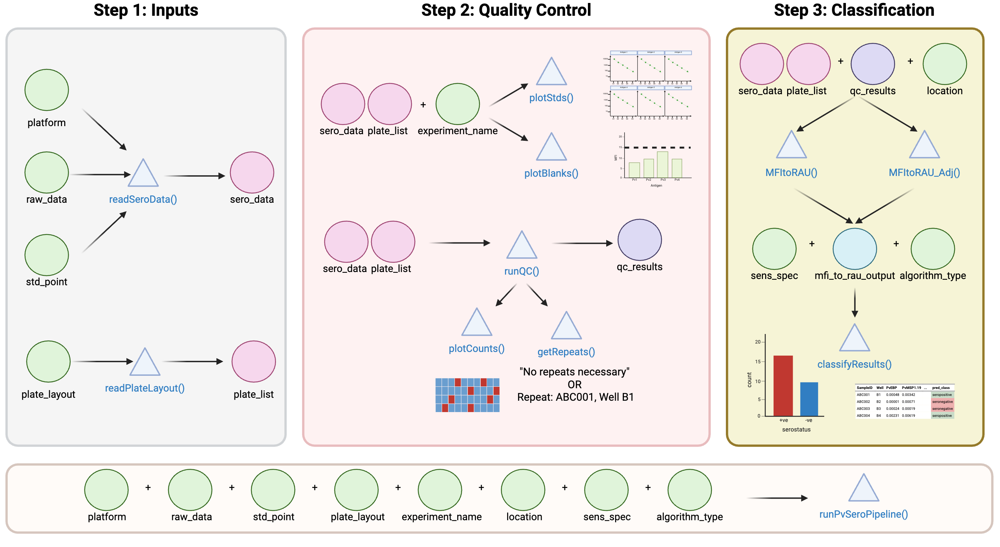

# PvSeroApp in R Tutorial

## Data Analysis: `runPvSeroPipeline()`

Run this global function
[`runPvSeroPipeline()`](https://dionnecargy.github.io/SeroTrackR/reference/runPvSeroPipeline.md)
embedded within the
[SeroTrackR](https://github.com/dionnecargy/SeroTrackR) R package! This
function contains all of the steps in order of how to perform the
*Plasmodium vivax* serology test and treat protocol as found in our
[application](https://dionnecargy.shinyapps.io/PvSeroApp/)!

### Visualisation of the PvSeroApp Pipeline



### Using Tutorial Dataset: Load the Data

We will be using the build-in files in the R package for this tutorial,
as shown below.

``` r
library(SeroTrackR)
library(tidyverse)

your_raw_data <- c(
  system.file("extdata", "example_MAGPIX_plate1.csv", package = "SeroTrackR"),
  system.file("extdata", "example_MAGPIX_plate2.csv", package = "SeroTrackR"), 
  system.file("extdata", "example_MAGPIX_plate3.csv", package = "SeroTrackR")
)
your_plate_layout <- system.file("extdata", "example_platelayout_1.xlsx", package = "SeroTrackR")
```

To run your OWN data, follow the code below and uncomment (i.e., remove
the hashtags):

``` r
your_raw_data <- c(
  "PATH/TO/YOUR/FILE/plate1.csv",
  "PATH/TO/YOUR/FILE/plate2.csv",
  "PATH/TO/YOUR/FILE/plate3.csv"
)
your_plate_layout <- "PATH/TO/YOUR/FILE/plate_layout.xlsx"
```

### Run Classification: Yes

``` r
final_analysis <- runPvSeroPipeline(
  raw_data = your_raw_data, 
  plate_layout = your_plate_layout, 
  platform = "magpix", 
  location = "ETH", 
  experiment_name = "experiment1", 
  classify = "Yes", 
  algorithm_type = "antibody_model", 
  sens_spec = "balanced"
)
#> PASS: File example_magpix_plate1.csv successfully validated.
#> PASS: File example_magpix_plate2.csv successfully validated.
#> PASS: File example_magpix_plate3.csv successfully validated.
#> Plate layouts correctly identified!
#> QC Processes completed.
#> MFI to RAU conversion completed.
#> Please write a standard point curve.
#> QC Plotting completed.
#> Pv classification completed.
```

#### Classification

This is a table containing the classification results (seropositive or
seronegative) for each `SampleID`. In this case, the classification
results are stored in the `pred_class_max` column as we chose the
`sens_spec = "balanced"`. If you change it to another type of threshold,
then the suffix of that column will change accordingly.

You will also see the relative antibody unit (RAU) values (columns with
antigen names), whether the sample passed QC check (`QC_total`) and the
`plate` that they were run on.

``` r
final_analysis[[1]] %>%
  head() %>% 
  kable()
```

| SampleID | Plate  | QC_total |     PvEBP |  Pv-fam-a |    PvMSP5 | PvMSP1-19 |    PvMSP8 | PvPTEX150 |     PvCSS |   PvRBP2b | pred_class_max |
|:---------|:-------|:---------|----------:|----------:|----------:|----------:|----------:|----------:|----------:|----------:|:---------------|
| ABC013   | plate1 | pass     | 0.0003339 | 0.0015045 | 0.0002163 | 0.0014567 | 0.0000195 | 0.0001591 | 0.0000772 | 0.0003714 | seropositive   |
| ABC097   | plate2 | pass     | 0.0004324 | 0.0015615 | 0.0001944 | 0.0013373 | 0.0000195 | 0.0001549 | 0.0000705 | 0.0009189 | seropositive   |
| ABC181   | plate3 | pass     | 0.0003822 | 0.0015832 | 0.0002144 | 0.0013711 | 0.0000195 | 0.0001582 | 0.0000710 | 0.0002070 | seropositive   |
| ABC022   | plate1 | pass     | 0.0200000 | 0.0200000 | 0.0007373 | 0.0194885 | 0.0006247 | 0.0003145 | 0.0006008 | 0.0004895 | seropositive   |
| ABC106   | plate2 | pass     | 0.0057123 | 0.0193731 | 0.0007458 | 0.0195240 | 0.0006263 | 0.0003077 | 0.0006480 | 0.0126203 | seropositive   |
| ABC190   | plate3 | pass     | 0.0098260 | 0.0200000 | 0.0007400 | 0.0200000 | 0.0006020 | 0.0003171 | 0.0006555 | 0.0175253 | seropositive   |

#### Standard Curve Plot

The standard curve plots are generated from the antibody data from the
standards you indicated in your plate layout (e.g. S1-S10) and Median
Fluorescent Intensity (MFI) units are displayed in log10-scale. In the
case of the PvSeroTaT multi-antigen panel, the antigens will be
displayed and in general your standard curves should look relatively
linear (only when the y-axis is on logarithmic scale).

``` r
final_analysis[[2]]
#> NULL
```

#### Bead Counts QC Plot

A summary of the bead counts for each plate well are displayed, with
blue indicating there are sufficient beads (≥15) or red when there are
not enough. If any of the wells are red, they should be double-checked
manually and re-run on a new plate if required.

The function will inform you whether there are “No repeats necessary” or
provide a list of samples to be re-run. In the example data, the beads
in plate 2 wells A1 and A2 will need to be repeated

``` r
final_analysis[[3]] # Plot
```


``` r
final_analysis[[4]] # Samples to repeat 
#> # A tibble: 2 × 4
#>   Location SampleID Plate  QC   
#>   <chr>    <chr>    <chr>  <chr>
#> 1 A1       Blank1   plate2 fail 
#> 2 A2       Blank2   plate2 fail
```

#### Blanks QC Plot

The Median Fluorescent Intensity (MFI) units for each antigen is
displayed for your blank samples. In general, each blank sample should
have ≤50 MFI for each antigen, if they are higher they should be
cross-checked manually.

In the example data, blank samples recorded higher MFI values for LF005
on plate 1 and should be checked to confirm this is expected from the
assay.

``` r
final_analysis[[5]]
```


#### Model Output Plot

The automated data processing in this app allows you to convert your
Median Fluorescent Intensity (MFI) data into Relative Antibody Units
(RAU) by fitting a 5-parameter logistic function to the standard curve
on a per-antigen level. The results from this log-log conversion should
look relatively linear for each antigen.

``` r
final_analysis[[6]]
#> $plate1
#> Ignoring unknown labels:
#> • fill : "Antigen"
```


    #> 
    #> $plate2
    #> Ignoring unknown labels:
    #> • fill : "Antigen"


    #> 
    #> $plate3
    #> Ignoring unknown labels:
    #> • fill : "Antigen"


### Run Classification: No

``` r
no_classification_final_analysis <- runPvSeroPipeline(
  raw_data = your_raw_data, 
  plate_layout = your_plate_layout, 
  platform = "magpix", 
  location = "ETH", 
  experiment_name = "experiment1", 
  classify = "No", ########################## key if you do NOT want any classification performed i.e., you do not have PvSeroTaT antigens 
  algorithm_type = "antibody_model", 
  sens_spec = "balanced"
)
#> PASS: File example_magpix_plate1.csv successfully validated.
#> PASS: File example_magpix_plate2.csv successfully validated.
#> PASS: File example_magpix_plate3.csv successfully validated.
#> Plate layouts correctly identified!
#> QC Processes completed.
#> MFI to RAU conversion completed.
#> Please write a standard point curve.
#> QC Plotting completed.
#> No Classification Performed.
```

#### MFI and RAU Data

``` r
no_classification_final_analysis[[1]]  %>%
  head() %>% 
  kable()
```

| SampleID | Plate  | QC_total | PvEBP_MFI | PvEBP_Dilution | Pv-fam-a_MFI | Pv-fam-a_Dilution | PvMSP5_MFI | PvMSP5_Dilution | PvMSP1-19_MFI | PvMSP1-19_Dilution | PvMSP8_MFI | PvMSP8_Dilution | PvPTEX150_MFI | PvPTEX150_Dilution | PvCSS_MFI | PvCSS_Dilution | PvRBP2b_MFI | PvRBP2b_Dilution |
|:---------|:-------|:---------|----------:|---------------:|-------------:|------------------:|-----------:|----------------:|--------------:|-------------------:|-----------:|----------------:|--------------:|-------------------:|----------:|---------------:|------------:|-----------------:|
| ABC013   | plate1 | pass     |      2712 |      0.0003339 |       1569.0 |         0.0015045 |        673 |       0.0002163 |           327 |          0.0014567 |      182.0 |        1.95e-05 |         936.0 |          0.0001591 |       223 |      0.0000772 |      1068.0 |        0.0003714 |
| ABC014   | plate1 | pass     |       134 |      0.0000216 |        378.0 |         0.0004204 |        117 |       0.0000277 |           197 |          0.0010331 |       58.0 |        1.95e-05 |         122.0 |          0.0000225 |        93 |      0.0000298 |       465.5 |        0.0001536 |
| ABC015   | plate1 | pass     |       182 |      0.0000232 |        209.0 |         0.0002466 |        208 |       0.0000616 |           374 |          0.0015985 |      221.5 |        1.95e-05 |         293.0 |          0.0000535 |       868 |      0.0002235 |       463.0 |        0.0001527 |
| ABC016   | plate1 | pass     |       152 |      0.0000222 |        229.5 |         0.0002688 |        101 |       0.0000244 |            89 |          0.0005994 |       48.0 |        1.95e-05 |         109.0 |          0.0000220 |       110 |      0.0000383 |       591.0 |        0.0001989 |
| ABC017   | plate1 | pass     |      1135 |      0.0001478 |        236.0 |         0.0002758 |        299 |       0.0000950 |           507 |          0.0019840 |      209.5 |        1.95e-05 |        1665.5 |          0.0002668 |       266 |      0.0000893 |       671.0 |        0.0002277 |
| ABC018   | plate1 | pass     |       174 |      0.0000229 |        395.0 |         0.0004370 |        175 |       0.0000460 |            78 |          0.0005452 |       70.0 |        1.95e-05 |         294.5 |          0.0000537 |        92 |      0.0000296 |       103.0 |        0.0000238 |

#### QC Plots

Repeat the same steps as above to find the QC plots!

``` r
#### Standard Curve Plot
no_classification_final_analysis[[2]]
#> NULL

#### Bead Counts QC Plot
no_classification_final_analysis[[3]] # Plot
```


``` r
no_classification_final_analysis[[4]] # Samples to repeat 
#> # A tibble: 2 × 4
#>   Location SampleID Plate  QC   
#>   <chr>    <chr>    <chr>  <chr>
#> 1 A1       Blank1   plate2 fail 
#> 2 A2       Blank2   plate2 fail

#### Blanks QC Plot
no_classification_final_analysis[[5]]
```


``` r

#### Model Output Plot
no_classification_final_analysis[[6]]
#> $plate1
#> Ignoring unknown labels:
#> • fill : "Antigen"
```


    #> 
    #> $plate2
    #> Ignoring unknown labels:
    #> • fill : "Antigen"


    #> 
    #> $plate3
    #> Ignoring unknown labels:
    #> • fill : "Antigen"


### Create a PDF Report

``` r
renderQCReport(
  your_raw_data, 
  your_plate_layout, 
  "magpix", 
  location = "ETH",
  path = "inst/tutorials/" # defaults to your current working directory
)
```
