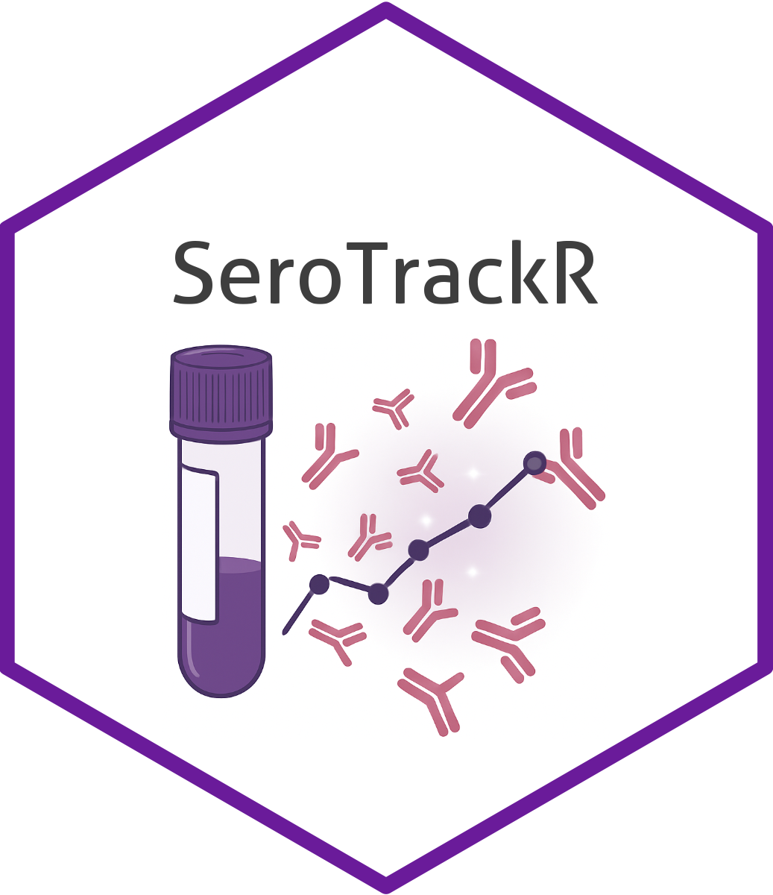

# Welcome to SeroTrackR



`{SeroTrackR}` is a tool to for serology data analysis and visualisation, and for the application of the machine learning algorithms implemented in the `{PvSeroApp}`. The R package is intended to give users more flexibility in assessing serology data and manipulate data visualisations to the user's interest. 
You can download the R package using the following: 

```{r}
#| eval: false
if(!require(devtools)){
  install.packages("devtools") # If not already installed
} 
devtools::install_github("dionnecargy/SeroTrackR")
library(SeroTrackR)
```

Alternatively you can download the package from the `{remotes}` R package: 

```{r}
#| eval: false

if(!require(remotes)){
  install.packages("remotes") # If not already installed
} 
library(remotes)
remotes::install_github("dionnecargy/SeroTrackR")
```

## Tutorials

- [PvSeroApp in R Tutorial](articles/PvSeroApp_in_R_Tutorial.html)
- [Pk/Pv/Pf Serology R Tutorial](articles/Pk/Pv/Pf_Serology_R_Tutorial.html)
